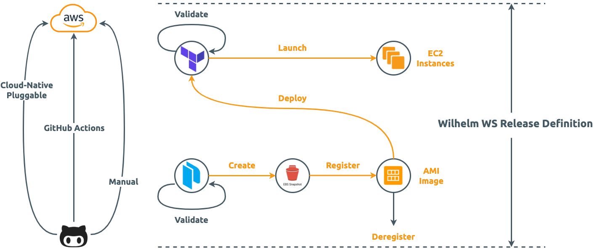

Wilhelm WS Release Definition
=============================

![AWS Badge][AWS Badge]
[![HashiCorp Packer Badge][HashiCorp Packer Badge]][HashiCorp Packer URL]
[![HashiCorp Terraform Badge][HashiCorp Terraform Badge]][HashiCorp Terraform URL]
[![Apache License][Apache License Badge]][Apache License, Version 2.0]

<!-- TOC -->
* [Wilhelm WS Release Definition](#wilhelm-ws-release-definition)
  * [Example Requests](#example-requests)
  * [Manual Deployment](#manual-deployment)
    * [Setting Up AWS Credentials](#setting-up-aws-credentials)
    * [Building AMI Image](#building-ami-image)
    * [Deploying EC2 Instance](#deploying-ec2-instance)
  * [GitHub Actions](#github-actions)
  * [Pluggable Component](#pluggable-component)
  * [Application Monitoring](#application-monitoring)
  * [Service Discovery](#service-discovery)
  * [License](#license)
<!-- TOC -->

__wilhelm-ws-release-definition__ deploys [wilhelm webservice] to AWS as an immutable infrastructure and is an ongoing
effort to fully automate the deployment in 3 different strategies (illustrated below):

1. [Manual Deployment](#manual-deployment): Scriptized deployment from local machine
2. GitHub Actions: Pipeline style deployment streaming from [wilhelm webservice]'s CI/CD to
   [wilhelm-ws-release-definition]()'s CI/CD
3. Cloud-Native Pluggable: Declaratively deploy [wilhelm webservice] as selected cloud-native immutable infrastructure



Example Requests
----------------

- query vocabulary paged: https://api.paion-data.dev/wilhelm/languages/german?perPage=100&page=1
- vocabulary count: https://api.paion-data.dev/wilhelm/languages/german/count
- expand: https://api.paion-data.dev/wilhelm/expand/nämlich
- search: https://api.paion-data.dev/wilhelm/search/das

Manual Deployment
-----------------

The manual deployment consists of 1 setup step and 2 semi-automated steps:

1. [setting up AWS credentials](#setting-up-aws-credentials)
2. [build AMI image](#building-ami-image)
3. [deploy EC2 instance](#deploying-ec2-instance)

### Setting Up AWS Credentials

1. Get release definition source code:

   ```console
   git clone git@github.com:QubitPi/wilhelm-ws-release-definition.git
   cd wilhelm-ws-release-definition
   ```

2. Open up a terminal and set AWS credentials: [AWS_ACCESS_KEY_ID] and [AWS_SECRET_ACCESS_KEY]

   ```console
   export AWS_ACCESS_KEY_ID=
   export AWS_SECRET_ACCESS_KEY=
   ```

### Building AMI Image

The [AMI] image uses  Ubuntu 22.04 as a base image and a
[dedicated Packer provisioner](https://github.com/QubitPi/packer-plugin-qubitpi/blob/master/docs/provisioners/webservice.mdx)
to install [wilhelm webservice] on top of it.

First, [Set Packer variables through environment variables](https://packer.qubitpi.org/packer/guides/hcl/variables#from-environment-variables)

```console
export PKR_VAR_ami_region=...
export PKR_VAR_war_source=/absolute/path/to/WAR/file
```

where

- `PKR_VAR_ami_region` is the [image region](https://docs.aws.amazon.com/AmazonRDS/latest/UserGuide/Concepts.RegionsAndAvailabilityZones.html#Concepts.RegionsAndAvailabilityZones.Availability) where AMI will be published to. The published image will be private
- `PKR_VAR_war_source` is the local absolute path to the
  [generates WAR file of wilhelm webservice](https://github.com/QubitPi/wilhelm-ws?tab=readme-ov-file#generating-war-file)

Then run the following on-click script which builds and publishes the AMI

```console
cd manual
./publish-image.sh
```

### Deploying EC2 Instance

[Set Terraform variables through environment variables](https://terraform.qubitpi.org/terraform/cli/config/environment-variables#tf_var_name)

   ```console
   export TF_VAR_ec2_region=...
   export TF_VAR_ec2_name="My Webservice"
   export TF_VAR_ec2_security_groups='["My Security Group 1", "My Security Group 2", "My Security Group 3"]'
   export TF_VAR_ssh_key_pair_name='mykey'
   export TF_VAR_neo4j_uri='...'
   export TF_VAR_neo4j_username='...'
   export TF_VAR_neo4j_password='...'
   export TF_VAR_neo4j_database='...'
   ```

where

- `TF_VAR_ec2_region` is the
  [EC2 runtime region](https://docs.aws.amazon.com/AmazonRDS/latest/UserGuide/Concepts.RegionsAndAvailabilityZones.html#Concepts.RegionsAndAvailabilityZones.Availability)
  where the AMI will be deployed into
- `TF_VAR_ec2_name` is the EC2 instance name what will be showing up in the EC2 instance list of AWS web console
- `TF_VAR_ec2_security_groups` iss the list of
  [AWS Security Group](https://docs.aws.amazon.com/vpc/latest/userguide/vpc-security-groups.html) names to associate
  with (yes, not ID, but name...)
- (__To be removed__) `TF_VAR_ssh_key_pair_name` is the ssh key pair name used to SSH into the EC2 after deployment
- `TF_VAR_neo4j_uri` is the URL for connecting to Neo4J database. For example, `neo4j+s://11654966.databases.neo4j.io`
- `TF_VAR_neo4j_username` is the username for connecting to the Neo4J database
- `TF_VAR_neo4j_password` is the password for connecting to the Neo4J database as the user
- `TF_VAR_neo4j_database` is the database name to connect to within the Neo4J

Then run the following on-click script which fetches the AMI and deploys an EC2 instance of it:

```console
./publish-image.sh
```

> [!TIP]
> 
> [The cloud-init log, which contains the startup logs, can be found at](https://stackoverflow.com/questions/51882030/commands-in-user-data-are-not-executed-in-terraform#comment90735245_51887124)
> `/var/log/cloud-init-output.log`

6. Delete old instance

GitHub Actions
--------------

Pluggable Component
-------------------

Application Monitoring
----------------------

Webservice logs are sent to an internal ELK instance. To enable the monitoring, simply add Logstash integration and
install agent on the production server. The logs will be available on integration dashboard.

Service Discovery
-----------------

[wilhelm webservice] is deployed in to a VPC behind a public facing gateway -

[the Paion Data API Gateway](https://status.paion-data.dev/history/paion-data-api-gateway). The gateway registration
essentially executes the following script logic:

```bash
# vocabulary paged & count
export WILHELM_WS_PRIVATE_IP=70.142.3.243 # This is just a random IP for illustration

curl -v -i -s -k -X POST https://api.paion-data.dev:8444/services \
  --data name=wilhelm-ws-languages \
  --data url="http://${WILHELM_WS_PRIVATE_IP}:8080/v1/neo4j/languages"
curl -i -k -X POST https://api.paion-data.dev:8444/services/wilhelm-ws-languages/routes \
  --data "paths[]=/wilhelm/languages" \
  --data name=wilhelm-ws-languages

# expand
curl -v -i -s -k -X POST https://api.paion-data.dev:8444/services \
  --data name=wilhelm-ws-expand \
  --data url="http://${WILHELM_WS_PRIVATE_IP}:8080/v1/neo4j/expand"
curl -i -k -X POST https://api.paion-data.dev:8444/services/wilhelm-ws-expand/routes \
  --data "paths[]=/wilhelm/expand" \
  --data name=wilhelm-ws-expand

# search
curl -v -i -s -k -X POST https://api.paion-data.dev:8444/services \
  --data name=wilhelm-ws-search \
  --data url="http://${WILHELM_WS_PRIVATE_IP}:8080/v1/neo4j/search"
curl -i -k -X POST https://api.paion-data.dev:8444/services/wilhelm-ws-search/routes \
  --data "paths[]=/wilhelm/search" \
  --data name=wilhelm-ws-search
```

We should see `HTTP/1.1 201 Created` as signs of success.

License
-------

The use and distribution terms for [wilhelm-ws-release-definition]() are covered by the [Apache License, Version 2.0].

[AMI]: https://docs.aws.amazon.com/AWSEC2/latest/UserGuide/AMIs.html
[Apache License, Version 2.0]: https://www.apache.org/licenses/LICENSE-2.0
[Apache License Badge]: https://img.shields.io/badge/Apache%202.0-F25910.svg?style=for-the-badge&logo=Apache&logoColor=white
[AWS Badge]: https://img.shields.io/badge/Amazon%20Web%20Service-FF9900.svg?style=for-the-badge&logo=amazonwebservices&logoColor=white
[AWS_ACCESS_KEY_ID]: https://docs.aws.amazon.com/cli/latest/userguide/cli-configure-envvars.html
[AWS_SECRET_ACCESS_KEY]: https://docs.aws.amazon.com/cli/latest/userguide/cli-configure-envvars.html

[HashiCorp Packer Badge]: https://img.shields.io/badge/Packer-02A8EF?style=for-the-badge&logo=Packer&logoColor=white
[HashiCorp Packer URL]: https://packer.qubitpi.org/packer/docs
[HashiCorp Terraform Badge]: https://img.shields.io/badge/Terraform-7B42BC?style=for-the-badge&logo=terraform&logoColor=white
[HashiCorp Terraform URL]: https://terraform.qubitpi.org/terraform/docs

[packer-plugin-qubitpi]: https://github.com/QubitPi/packer-plugin-qubitpi
[terraform-provider-qubitpi]: https://github.com/QubitPi/terraform-provider-qubitpi

[wilhelm webservice]: https://github.com/QubitPi/wilhelm-ws
